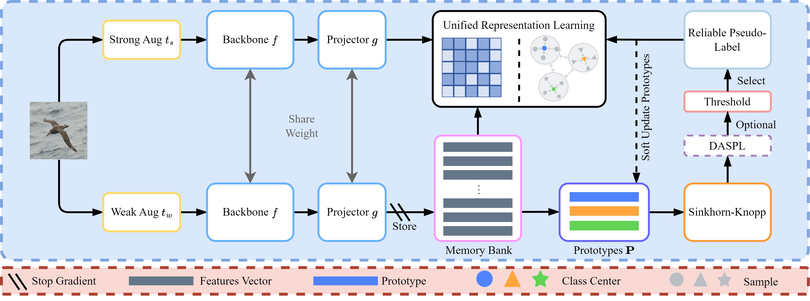

# UGCD: Unified Representation Learning for Generalized Classification Discovery
UGCD: Unified Representation Learning for Generalized Classification Discovery Official pytorch Implementation.
## Abstruct

Generalized category discovery (GCD) aims to accurately classify known classes that exist in labeled data and discover novel unseen classes that emerge in unlabeled data. Most GCD methods use distinct pipelines of supervised and self-supervised learning on labeled and unlabeled data to learn discriminative representations, respectively. However, these separate pipelines for known and novel categories may lead to a discrepancy in the learning process, which consequently limits representation ability and undermines model performance. In this study, we propose a unified representation learning method for GCD. Specifically, we first propose a Reliable Pseudo-Labels Generation (RPLG) strategy to produce high-quality pseudo-labels for unlabeled data by using asymmetric data augmentation and distribution-adaptive label assignment. Then, we introduce a Unified Representation Learning (URL) framework to learn representations of known and novel classes on both labeled and unlabeled data with the aid of a softened supervised contrastive loss and Kozachenko-Leonenko entropy regularization. Furthermore, we develop a Soft Prototypes-based Novel Category Discovery (SPNCD) approach to effectively learn known and novel classes from unlabeled data. Extensive experiments on generic, fine-grained, and imbalanced datasets demonstrate that our method outperforms current state-of-the-art methods, particularly on the more challenging fine-grained and imbalanced datasets, with a 9.5% overall accuracy improvement on Stanford Cars and 7.8% on Herbarium 19.
### Dependencies

```bash
pip install -r requirements.txt
```

### Config

Set paths to datasets and desired log directories in ```config.py```


### Datasets

We use fine-grained benchmarks in this paper, including:

* [The Semantic Shift Benchmark (SSB)](https://github.com/sgvaze/osr_closed_set_all_you_need#ssb) and [Herbarium19](https://www.kaggle.com/c/herbarium-2019-fgvc6)

We also use generic object recognition datasets, including:

* [CIFAR-10/100](https://pytorch.org/vision/stable/datasets.html) and [ImageNet-100](https://image-net.org/download.php)


### Scripts

**Train the model**:

```
bash scripts/run_${DATASET_NAME}.sh
```

### Results

|    Dataset    	|  All  | Known | Novel |
|:-------------:	|:----:|:----:|:----:|
|    CIFAR10    	| 97.8 	| 97.3 	| 98.0 	|
|    CIFAR100   	| 84.0 	| 83.9 	| 84.1 	|
|  ImageNet-100 	| 85.3 	| 94.3 	| 80.8 	|
|      CUB      	| 71.2 	| 70.1 	| 71.7 	|
| Stanford Cars 	| 63.3 	| 73.7 	| 58.3 	|
| FGVC-Aircraft 	| 61.5 	| 64.8 	| 59.9 	|
|  Herbarium 19 	| 51.8 	| 61.3 	| 46.7 	|

## Acknowledgements

The codebase is largely built on these repo: https://github.com/sgvaze/generalized-category-discovery. and https://github.com/CVMI-Lab/SimGCD. We thank the authors for sharing their codes.
